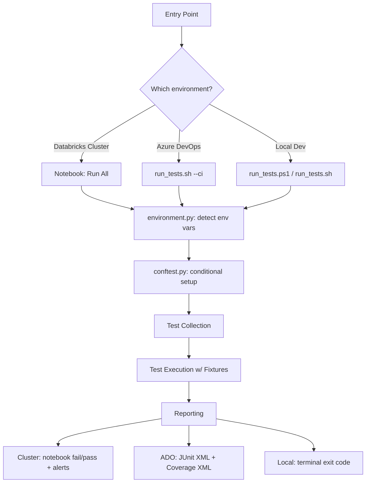

# Pytest Testing Infrastructure — Architecture & Design Document

**Project:** Databricks Asset Bundles — Cross-Environment Test Framework
**Scope:** 6 bundles · 3 execution environments · 0 code changes between them

---

## 1. Executive Summary

This document describes the architecture of the pytest-based testing infrastructure built for the Databricks Asset Bundles project. The framework is designed around a single core principle: **the same test files run unmodified on a Databricks cluster, in Azure DevOps CI, and on a developer's local machine.**

This is achieved through a runtime environment detector (`environment.py`) that drives all conditional behavior inside `conftest.py` — stubbing, environment variables, and fixture configuration — so that no environment-specific branching logic ever needs to appear in the test files themselves.

By the end of this document, the reader should understand the full lifecycle of a test run: trigger → environment detection → fixture setup → collection → execution → teardown → reporting.

---

## 2. Design Goals

| Goal | How it's achieved |
|---|---|
| Single codebase, three environments | Central environment detection drives all conditionals in one file (`conftest.py`) |
| No environment-specific code in tests | Fixtures (`spark`, `mock_dbutils`, `mock_env`) abstract environment differences away from test authors |
| Fast local iteration | Session-scoped `spark` fixture avoids repeated ~10–15s SparkSession startup |
| Safe by default | `monkeypatch`-based env var injection auto-restores state; stubs never overwrite real cluster values (`setdefault`, not assignment) |
| CI/CD-friendly | Uniform exit-code convention (0 = pass, non-zero = fail) across all three environments |
| Fail fast on config errors | `--strict-markers` rejects typoed markers at collection time rather than silently ignoring them |

---

## 3. High-Level Architecture

The system has three architectural layers:

1. **Trigger layer** — how a test run is initiated (Section 4)
2. **Detection & setup layer** — `environment.py` + `conftest.py` (Sections 5–6)
3. **Execution & reporting layer** — collection, per-test lifecycle, markers, results (Sections 7–10)

---

## 4. Entry Points (Trigger Layer)

There are three ways a test run is triggered. All three converge on the same underlying test suite.

### 4.1 Databricks Cluster (Notebook)

- Triggered by running the notebook's "Run All" — 8 cells execute in sequence.
- **Cell 1:** Installs pure-Python dependencies via `subprocess pip`, deliberately *not* the `%pip` magic command, because `%pip` restarts the kernel and would wipe out in-memory state.
- **Cell 5:** Builds `sys.path`, adding all eight bundle source directories.
- **Cell 6:** Calls `pytest.main()` **in-process** — pytest runs inside the notebook's own Python process, so the cluster's `SparkSession`, `dbutils`, and environment variables are directly available without mocking.

### 4.2 Azure DevOps CI

- Triggered via `run_tests.sh --ci`.
- The script detects the `TF_BUILD` environment variable (set automatically by ADO) and sets `IS_ADO_CI = true`.
- Runs pytest with:
  - JUnit XML output → feeds the ADO **Test Results** tab
  - Coverage XML output → feeds the ADO **Code Coverage** tab

### 4.3 Local Development

- Triggered via `run_tests.ps1` (Windows) or `run_tests.sh` (Linux/macOS), with no special flags.
- Since neither `DATABRICKS_RUNTIME_VERSION` nor `TF_BUILD` is present, `IS_LOCAL_DEV = true`.
- Developer gets colored terminal output.
- `local_only`-marked tests are enabled, since the local filesystem is available.

**Key architectural point:** all three entry points call into the *same* test suite with no branching logic in the test files — divergence is handled entirely by environment detection.

---

## 5. Environment Detection (`environment.py`)

This module is the "brain" of the framework and is the first thing `conftest.py` imports.

### 5.1 Detection Logic

It checks exactly two environment variables:

| Variable checked | If present → |
|---|---|
| `DATABRICKS_RUNTIME_VERSION` | Running on a Databricks cluster |
| `TF_BUILD` | Running in Azure DevOps |
| *(neither present)* | Running on a local developer machine |

### 5.2 Derived Flags

From those two checks, four booleans are derived and exported for use throughout `conftest.py`:

- `IS_DATABRICKS`
- `IS_ADO_CI`
- `IS_LOCAL_DEV`
- `NEEDS_RUNTIME_STUBS`

### 5.3 Truth Table

| Environment | `IS_DATABRICKS` | `IS_ADO_CI` | `IS_LOCAL_DEV` | `NEEDS_RUNTIME_STUBS` |
|---|:---:|:---:|:---:|:---:|
| Databricks Cluster | ✅ | ❌ | ❌ | ❌ (real SDK is natively installed) |
| Azure DevOps CI | ❌ | ✅ | ❌ | ✅ (SDK not present) |
| Local Dev | ❌ | ❌ | ✅ | ✅ (SDK not present) |

These four flags are the single source of truth that every conditional branch in `conftest.py` reads from — this is *why* the same test files work everywhere.

---

## 6. `conftest.py` Loading Sequence

`conftest.py` executes nine steps in strict order when pytest starts:

| Step | Action | Purpose |
|---|---|---|
| **1** | Add `unit_tests/` to `sys.path` | Makes `environment.py`, assertion helpers, and sample-data fixtures importable |
| **2** | Import the environment detector | Establishes the four booleans described in Section 5 |
| **3** | If **not** on cluster → stub the Databricks runtime | Pre-registers 8 fake modules in `sys.modules` so module-level imports like `from databricks.sdk.runtime import dbutils, spark` resolve to `MagicMock`s instead of raising `ImportError`. Skipped on cluster, where the real packages exist. |
| **4** | Add all bundle source directories to `sys.path` | 8 paths, each existence-checked before adding — enables `import GcobUtils` to resolve to `GCOB_Consumer/src/GcobUtils.py` |
| **5** | Set 17 fake environment variables (module level) | **Critical step.** Some source modules read `os.environ[...]` at *import time* (e.g. `GcobUtils.py` reading `APP_REG_APP_ID`). Without this, collection fails with `KeyError` before any test runs. Uses `os.environ.setdefault(...)`, never plain assignment, so real cluster values are never clobbered. |
| **6** | Define fixtures | See Section 6.1 below |
| **7** | Print environment banner | Self-describing CI logs — shows Runtime / Spark / Stubs / Env mock / Root |
| **8** | Auto-skip `local_only` tests on cluster (collection hook) | Belt-and-suspenders alongside the `-m` marker filter (Section 8) |

### 6.1 Key Fixtures Defined in Step 6

| Fixture | Scope | Behavior |
|---|---|---|
| `spark` | `session` | One `SparkSession` per test run. On cluster: `getOrCreate()` returns the existing session. Locally: builds a `local[2]` session with Delta support. |
| `mock_env` | function, **autouse=True** | Runs before every test. Sets the 17 fake env vars via `monkeypatch.setenv`, which auto-restores original values after each test — no cross-test pollution. |

---

## 7. Test Collection

After `conftest.py` finishes loading, pytest performs collection:

1. **Read `testpaths`** from `pyproject.toml` — 7 directories: the shared `unit_tests/` folder plus all 6 bundle-specific test directories.
2. **Import each `test_*.py` file.** This triggers all module-level imports in the file under test — e.g. importing `test_gcob_utils.py` triggers `import GcobUtils`, which in turn executes `GcobUtils.py`'s module-level code (`os.environ` reads, `dbutils` import, a `secrets.get` call). All of these succeed only because Steps 3 and 5 of `conftest.py` already ran.
3. **Collect test functions/classes**, expanding parametrized tests into individual items (e.g. `test_known_sources` with 7 `parametrize` values → 7 test items).
4. **Evaluate the marker expression** (e.g. `-m 'not local_only'` on cluster) to exclude filesystem-dependent tests. The collection hook from Step 8 also tags matching tests with a skip marker as a redundant safeguard.

**Output:** a list of test items, each with its fixture dependency graph resolved, ready for execution.

---

## 8. Per-Test Execution Lifecycle

Traced using the example test `test_request_exception_returns_partial_results`.

### 8.1 Fixture Setup (inside-out order)

1. **`mock_env`** (autouse) — no-op on cluster (real env vars used); on local/CI, sets 17 vars via `monkeypatch.setenv`.
2. **`_suppress_gcob_utils_error_logs`** (autouse, scoped to `test_gcob_utils.py`) — sets the `GcobUtils` logger to `CRITICAL`, filtering expected `ERROR`-level noise out of test output.
3. **`spark`** — provides the shared `SparkSession`; created once, reused thereafter (this reuse is what keeps total suite runtime around ~50 seconds instead of minutes).
4. **On-demand fixtures** (`gcob_party`, `make_df`, `mock_dbutils`, etc.) are instantiated as requested by the test.

### 8.2 Test Body

1. `MagicMock` objects simulate `requests.get` responses.
2. `GcobUtils.requests.get` is patched with `side_effect=[good_page, bad_page]`.
3. `logging.getLogger("GcobUtils").error` is patched to suppress the expected error log.
4. `GcobUtils.get_graph_paginated_data(url, headers)` is called.
   - First `requests.get` call → returns `good_page` (1 record).
   - Second call → raises `RequestException`.
   - Function catches the exception, logs (suppressed), breaks the pagination loop, returns records collected so far.
5. **Assertion:** result equals `[{"id": "u1"}]` → test **passes**.

### 8.3 Fixture Teardown (outside-in / reverse order)

1. `gcob_party` cleans up (if used).
2. `spark` does **not** tear down — session-scoped, reused across the whole run.
3. Logger-suppression fixture restores the original log level.
4. `mock_env` — `monkeypatch` restores all environment variables automatically.

**Result recorded:** `PASSED` / `FAILED` / `ERROR` / `SKIPPED`, and pytest advances to the next test item.

---

## 9. Marker Taxonomy & Filtering

12 markers are registered in `pyproject.toml`, across 4 categories:

| Category | Markers | Purpose |
|---|---|---|
| **Test type** | `unit`, `spark`, `integration` | `unit` = pure Python, no Spark · `spark` = needs a PySpark session · `integration` = needs live Azure/Databricks services |
| **Bundle** | `radarv1`, `gcob_consumer`, `gcob_reportingv1`, `adhoc`, `clusters`, `party_catalog` | One marker per bundle, enabling selective runs (e.g. `-m gcob_consumer`) |
| **Category** | `dq`, `slow` | `dq` = data-quality validation · `slow` = tests taking >10 seconds |
| **Environment** | `databricks_only`, `local_only` | Gate tests to environments where their dependencies exist |

### 9.1 Marker Expressions

The `-m` flag accepts boolean expressions, e.g.:

- `not local_only` — excludes filesystem-dependent tests (used on cluster)
- `unit or spark` — runs everything except `integration`
- `gcob_consumer` — runs only that bundle's tests
- `gcob_consumer and unit` — combinable

### 9.2 Strictness & Safeguards

- **`--strict-markers`** is enabled: an unregistered/typoed marker (e.g. `@pytest.mark.unitt`) causes an immediate failure rather than being silently ignored.
- **Double protection for `local_only` on cluster:** excluded both by the `-m` filter *and* by the `pytest_collection_modifyitems` hook (Section 6, Step 8) that tags a skip marker — belt and suspenders.

---

## 10. Results & Reporting

Reporting is environment-specific, though all three share one convention: **exit code 0 = pass, non-zero = fail.**

| Environment | Mechanism |
|---|---|
| **Databricks Cluster** | Cell 6 captures pytest's output via `contextlib.redirect_stdout`. Cell 7 parses it with regex to extract pass/fail/error/skip counts and duration. Cell 8 raises an exception on non-zero exit code, causing Databricks Workflows to mark the notebook **FAILED** — triggering email alerts and blocking downstream pipeline tasks. |
| **Azure DevOps CI** | JUnit XML written to `test-output.xml` → published to the ADO **Test Results** tab. Coverage XML published to the **Code Coverage** tab. A `COVERAGE_THRESHOLD` pipeline variable enforces a minimum coverage bar; the pipeline fails if coverage drops below it. |
| **Local Dev** | Colored terminal output (if supported). Exit code 0/1 is the only signal — immediate feedback for the developer. |

The shared exit-code convention means the framework integrates with any CI/CD system without environment-specific glue code.

---

## 11. Cross-Environment Compatibility Matrix

| Aspect | Databricks Cluster | Azure DevOps CI | Local Dev |
|---|---|---|---|
| Trigger | Notebook "Run All" | `run_tests.sh --ci` | `run_tests.ps1` / `run_tests.sh` |
| Detected via | `DATABRICKS_RUNTIME_VERSION` | `TF_BUILD` | (absence of both) |
| Databricks SDK | Real (native) | Stubbed | Stubbed |
| Env vars | Real (cluster-provided) | Fake (17 vars, `setdefault`) | Fake (17 vars, `setdefault`) |
| SparkSession | `getOrCreate()` — existing cluster session | `local[2]` w/ Delta | `local[2]` w/ Delta |
| `local_only` tests | Skipped (double-guarded) | N/A (not applicable) | Enabled |
| Output format | Notebook cell output + exception on failure | JUnit XML + Coverage XML | Colored terminal |
| Failure signal | Notebook marked FAILED → alerts, blocked pipeline tasks | ADO pipeline failure | Non-zero exit code |
| **Code changes required** | **Zero** | **Zero** | **Zero** |

**This is the headline architectural outcome:** the same 91 tests pass identically on a developer's laptop and on the production cluster, with no special setup and no `if IS_DATABRICKS:` branching inside the test files themselves. All environment-sensitive behavior lives in exactly one place — `conftest.py`, driven by `environment.py`.

---

## 12. Key Design Decisions & Rationale

| Decision | Rationale |
|---|---|
| `subprocess pip` instead of `%pip` in the notebook | `%pip` restarts the kernel, wiping in-memory state needed later in the same run |
| In-process `pytest.main()` call on cluster | Gives tests direct access to the cluster's live `SparkSession`, `dbutils`, and env vars without any bridging layer |
| Module stubbing via `sys.modules` pre-registration | Allows module-level SDK imports (`from databricks.sdk.runtime import ...`) to succeed off-cluster without editing source files |
| `os.environ.setdefault()` instead of direct assignment | Guarantees fake env vars used for local/CI testing can never silently override real cluster configuration |
| Session-scoped `spark` fixture | SparkSession startup costs ~10–15s; sharing one instance across the whole suite keeps total runtime near ~50s |
| `monkeypatch` for env var injection | Automatic, leak-proof restoration after each test — removes an entire class of cross-test pollution bugs |
| `--strict-markers` | Converts a silent typo (test quietly not running) into a loud collection-time failure |
| Double-guarding `local_only` exclusion (marker filter + collection hook) | Defense in depth — a single point of failure in marker filtering won't cause a filesystem-dependent test to run in an unsupported environment |

---

## 13. Appendix: Glossary

- **Bundle** — one of six independently deployable Databricks Asset Bundle projects (e.g. `GCOB_Consumer`, `RadarV1`).
- **Stub** — a `MagicMock`-backed fake module pre-registered in `sys.modules`, standing in for the Databricks SDK where it isn't natively available.
- **Autouse fixture** — a pytest fixture applied to every test in scope without needing to be explicitly requested.
- **`local_only` / `databricks_only`** — markers gating tests to the environment where their required dependencies (filesystem or live cluster) actually exist.
