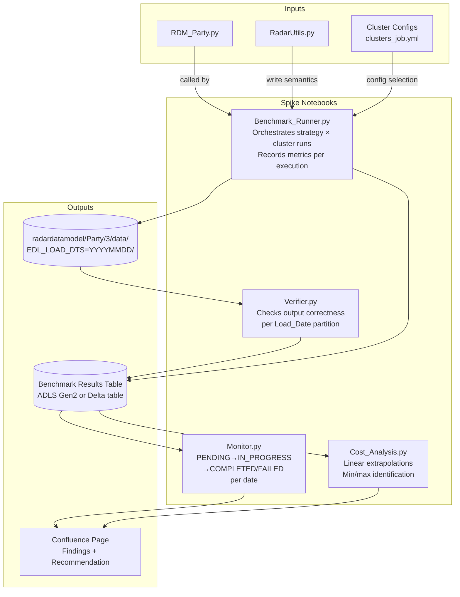

# Design Document: RDM Party Backfill Spike

## Overview

This document describes the technical design for the RDM_Party backfill spike — a time-boxed investigation comparing two loading strategies (monthly and day-by-day) across multiple Databricks cluster configurations for the historical backfill of ~10.75 billion records (215 days × ~50 million records/day).

The spike does not produce a production feature. It produces benchmark evidence, a data-driven recommendation, and implementation guidance. The primary artefact is a Confluence page; the secondary artefact is a set of reusable benchmark and verification notebooks.

### Context

`RDM_Party.py` consumes nine source dependencies — GCDS, GCOB, Legacy2, GIC, KN1, RANZ, KYCMasterListRegistry (external sources), plus Party_SystemIdentifier and Party_KN1Cases (internal RadarDataModel objects) — and writes consolidated party data to Azure Data Lake Storage Gen2 under `radardatamodel/Party/3/data/EDL_LOAD_DTS=YYYYMMDD/`. The notebook accepts a `Load_Date` widget (`YYYYMMDD`) and derives `RunType = "historical"` when that widget is set.

Write semantics in `RadarUtils.py` (`save_to_saradar_storage_account`, line ~55) use `df.repartition(1).write.format("parquet").mode("overwrite")` scoped to the `EDL_LOAD_DTS=YYYYMMDD/` partition folder, making every individual daily execution safe to re-run without producing duplicates.

The team's Databricks workspace currently defines three legacy (non-UC) cluster sizes — `dab_small_cluster` (Standard_D8ads_v5, single-node), `dab_medium_cluster` (Standard_D16ads_v5, autoscale 2–4), `dab_large_cluster` (Standard_D32ads_v5, autoscale 2–4) — and three Unity Catalog clusters — `Radar_small_cluster` (Standard_D4ads_v5, 2 fixed), `Radar_medium_cluster` (D4ads workers / D8ads driver, autoscale 2–4), `Radar_large_cluster` (D4ads workers / D8ads driver, autoscale 2–8). All clusters run Databricks Runtime with PHOTON engine.

---

## Architecture

The spike is structured as four independent Databricks notebooks supported by a shared tracking schema and a Verifier notebook. No new infrastructure is provisioned; all notebooks run on existing cluster definitions and write results to existing ADLS Gen2 containers.



### Key Architectural Decisions

**Decision 1 — Separate Benchmark_Runner from RDM_Party.py.**
`RDM_Party.py` is not modified during the spike. The `Benchmark_Runner` notebook wraps it via `dbutils.notebook.run()` (or `%run`), passing `Load_Date` as a widget parameter and capturing wall-clock time with Python `time.time()` bookends. This keeps the spike non-destructive with respect to the production notebook.

**Decision 2 — Single shared results Delta table.**
All execution metadata and metrics are written to a single Delta table in the `radardatamodel` container (`spike_benchmark_results`). Using Delta enables append-only writes, schema enforcement, and easy aggregation for the cost analysis notebook.

**Decision 3 — Verifier reads output partitions directly.**
The `Verifier.py` notebook reads the output parquet files from `Party/3/data/EDL_LOAD_DTS=D/` and the source partitions to compute expected counts independently. It does not depend on `RDM_Party.py` internals, making verification reproducible.

**Decision 4 — Cluster configurations map directly to existing definitions.**
Rather than creating new clusters, the spike maps requirement categories to existing cluster definitions:
- Single-node baseline → `dab_small_cluster` (Standard_D8ads_v5, 0 workers, 32 GB, 8 vCPU, Photon)
- High-end multi-node → `dab_large_cluster` (Standard_D32ads_v5, autoscale 2–4 workers, ≥256 GB combined, Photon)
- Autoscaling/spot variant → `dab_medium_cluster` (Standard_D16ads_v5, autoscale 2–4 workers, on-demand)

A fourth configuration can be added: `Radar_large_cluster` (Unity Catalog, D4ads workers / D8ads driver, autoscale 2–8) to cover the UC-enabled environment as an optional additional data point.

---

## Components and Interfaces

### 1. Benchmark_Runner Notebook

**Purpose:** Orchestrate all benchmark executions, capture metrics, and write results to the shared Delta table.

**Inputs (widgets):**
| Widget | Type | Description |
|---|---|---|
| `strategy` | string | `"monthly"` or `"day_by_day"` |
| `cluster_config_id` | string | e.g., `"dab_small"`, `"dab_large"`, `"dab_medium"` |
| `load_dates` | string | Comma-separated `YYYYMMDD` values (day-by-day) or `YYYYMM` month identifier (monthly) |
| `run_number` | int | Run index within the 2–5 repetition range |

**Outputs:**
- Appends one row per execution to `spike_benchmark_results` Delta table.
- Calls `RDM_Party.py` via `dbutils.notebook.run("RDM_Party", timeout_seconds=21600, arguments={"Load_Date": load_date})`.

**Metrics captured per execution:**
```
execution_id, load_date, run_type, strategy, cluster_config_id, run_number,
wall_clock_minutes, records_processed, throughput_rps,
peak_cpu_pct, peak_memory_pct, peak_io_mb_s,
total_dbu, estimated_cost_usd, dbu_rate_usd, dbu_rate_date,
spark_tasks, shuffle_read_bytes, shuffle_write_bytes, bytes_spilled,
error_message, spark_stage_at_failure, retry_attempt,
outlier_flag, outlier_deviation_pct,
source_partition_paths  -- JSON array for comparability verification
```

### 2. Verifier Notebook

**Purpose:** Validate output correctness for each processed `Load_Date`. Called after each `Benchmark_Runner` execution or as a standalone sweep.

**Key checks performed:**

| Check | Description |
|---|---|
| Non-empty partition | `Party/3/data/EDL_LOAD_DTS=D/` exists and contains ≥ 1 parquet file |
| Record count ≥ 80% | `output_count ≥ 0.8 × distinct_party_ids_across_sources` |
| Source coverage | `Application` column contains at least one row per non-empty source for that date |
| Exactly one folder | No duplicate `EDL_LOAD_DTS=D` folders in the output path |
| Schema match | Column names and types match stored RDM_Party v3 schema reference |
| Date assignment | All records in `EDL_LOAD_DTS=D/` have `EDL_LOAD_DTS` field = D |
| Source attribution | All `Application` values are in the declared nine-source set |

Writes results to `spike_verifier_results` Delta table keyed by `(load_date, execution_id, check_name)`.

### 3. Cost_Analysis Notebook

**Purpose:** Read benchmark results, compute all linear extrapolations, identify min-cost and min-duration combinations, and produce the dataset projection range.

**Core formulas:**
```python
total_dbu        = mean_dbu_per_day × 215
total_duration   = mean_duration_per_day × 215          # must be ≥ single-run duration
estimated_cost   = total_dbu × dbu_rate_usd
cost_20_datasets = estimated_cost × 20
cost_25_datasets = estimated_cost × 25
```

**Outputs:** Formatted tables exported as Confluence wiki markup and embedded directly in the Confluence page via the API.

### 4. Monitor Notebook / Status Tracker

**Purpose:** Maintain a per-`Load_Date` status view (`PENDING`, `IN_PROGRESS`, `COMPLETED`, `FAILED`) for the full 215-day backfill range. Enables targeted re-runs by filtering for `FAILED` or `PENDING` dates.

**Table:** `spike_backfill_status` with columns: `load_date`, `status`, `last_updated_ts`, `execution_id`, `failure_reason`.

**Status transitions:**
```
PENDING → IN_PROGRESS  (on Benchmark_Runner start)
IN_PROGRESS → COMPLETED (on successful Verifier pass)
IN_PROGRESS → FAILED    (on execution error or Verifier failure)
FAILED → IN_PROGRESS    (on re-submission)
```

### 5. Shared Delta Schema (`spike_benchmark_results`)

Location: `abfss://radardatamodel@saradar{env}.dfs.core.windows.net/spike/benchmark_results/`

Schema enforced at write time. Partition column: `strategy` (to enable efficient strategy-level queries).

---

## Data Models

### Benchmark Results Table (`spike_benchmark_results`)

```
Column                    Type        Nullable  Precision Notes
─────────────────────────────────────────────────────────────────────
execution_id              STRING      N         -         UUID, PK
load_date                 STRING      N         -         YYYYMMDD
run_type                  STRING      N         -         "historical"
strategy                  STRING      N         -         "monthly" | "day_by_day"
cluster_config_id         STRING      N         -         e.g. "dab_small"
run_number                INT         N         -         1–5
wall_clock_minutes        DECIMAL     N         2dp       From job submit to terminal state
records_processed         BIGINT      N         -         Total records in output partition
throughput_rps            DECIMAL     N         2dp       records_processed / (wall_clock_minutes × 60)
peak_cpu_pct              DECIMAL     Y         2dp       From Databricks cluster metrics API
peak_memory_pct           DECIMAL     Y         2dp       From Databricks cluster metrics API
peak_io_mb_s              DECIMAL     Y         2dp       From Databricks cluster metrics API
total_dbu                 DECIMAL     N         4dp       From Databricks job run API
estimated_cost_usd        DECIMAL     N         2dp       total_dbu × dbu_rate_usd
dbu_rate_usd              DECIMAL     N         4dp       Published list price at benchmark time
dbu_rate_date             DATE        N         -         Date price was retrieved
spark_tasks               INT         Y         -         Total Spark tasks in job
shuffle_read_bytes        BIGINT      Y         -         Spark shuffle read bytes
shuffle_write_bytes       BIGINT      Y         -         Spark shuffle write bytes
bytes_spilled             BIGINT      Y         -         Bytes spilled to disk
error_message             STRING      Y         -         Null if success
spark_stage_at_failure    STRING      Y         -         Stage name at failure
retry_attempt             INT         N         -         0 for first attempt, 1–2 for retries
status                    STRING      N         -         "SUCCESS" | "FAILED"
zero_metric_reason        STRING      Y         -         CACHED_RESULT | FREE_TIER | BELOW_MEASUREMENT_THRESHOLD
outlier_flag              BOOLEAN     Y         -         True if deviation > 20% from mean
outlier_deviation_pct     DECIMAL     Y         2dp       Deviation percentage
source_partition_paths    STRING      Y         -         JSON array of source paths used
```

### Verifier Results Table (`spike_verifier_results`)

```
Column              Type      Nullable  Notes
───────────────────────────────────────────────
verification_id     STRING    N         UUID
execution_id        STRING    N         FK to benchmark_results
load_date           STRING    N         YYYYMMDD
check_name          STRING    N         e.g. "non_empty_partition"
passed              BOOLEAN   N
expected_value      STRING    Y         Stringified
actual_value        STRING    Y         Stringified
failure_detail      STRING    Y         Null if passed
verified_at_ts      TIMESTAMP N
```

### Backfill Status Table (`spike_backfill_status`)

```
Column          Type      Nullable  Notes
──────────────────────────────────────────
load_date       STRING    N         PK
status          STRING    N         PENDING | IN_PROGRESS | COMPLETED | FAILED
last_updated_ts TIMESTAMP N
execution_id    STRING    Y         FK to latest benchmark attempt
failure_reason  STRING    Y         Null unless FAILED
```

### Cluster Configuration Reference

The cluster configurations to benchmark (mapped to existing `clusters_job.yml` definitions):

| Config ID | Cluster Name | Node Type | Workers | Total Memory | vCPUs | Autoscale | Spot |
|---|---|---|---|---|---|---|---|
| `dab_small` | DAB-small | Standard_D8ads_v5 | 0 (single-node) | 32 GB | 8 | No | No |
| `dab_medium` | DAB-medium | Standard_D16ads_v5 | 2–4 | 128–256 GB | 32–64 | Yes (2–4) | No |
| `dab_large` | DAB-large | Standard_D32ads_v5 | 2–4 | 256–512 GB | 64–128 | Yes (2–4) | No |
| `radar_large_uc` | Radar-large-UC | D4ads workers / D8ads driver | 2–8 | 64–320 GB | 16–96 | Yes (2–8) | No |

> All cluster configurations use the Databricks PHOTON runtime engine. Spot instance testing is out of scope for the initial spike unless the team's Azure subscription policy allows it.

---

## Correctness Properties

*A property is a characteristic or behavior that should hold true across all valid executions of a system — essentially, a formal statement about what the system should do. Properties serve as the bridge between human-readable specifications and machine-verifiable correctness guarantees.*

The following properties are derived from the prework analysis of the requirements acceptance criteria. Properties covering documentation deliverables, one-time configuration checks, and stakeholder process steps are classified as smoke tests and excluded from this section.

---

### Property 1: Idempotent Execution

*For any* `Load_Date` D and fixed source partitions, executing `RDM_Party.py` twice with `Load_Date = D` and `RunType = "historical"` against the same source data SHALL produce an output record count in `Party/3/data/EDL_LOAD_DTS=D/` equal across both executions, with a tolerance of 0 records.

**Validates: Requirements 5.4, 5.6, 9.1**

---

### Property 2: Partition Additivity Invariant

*For any* contiguous date range [D_start, D_end] where all partitions have been written, the sum of individual `count(EDL_LOAD_DTS=D)` for every D in the range SHALL equal the total record count obtained by reading all partitions in the range together in a single Spark read, within a tolerance of 0 records.

**Validates: Requirements 5.7, 9.2**

---

### Property 3: Date Assignment Invariant

*For any* output partition written for `Load_Date` D, every record in the partition SHALL have its `EDL_LOAD_DTS` field set to exactly D — no record shall carry a different date value.

**Validates: Requirements 9.3**

---

### Property 4: Source Attribution Invariant

*For any* output partition written for `Load_Date` D, every record SHALL have its `Application` field set to one of the nine declared source values: `{GCDS, GCOB, Legacy2, GIC, KN1, RANZ, KYCMasterListRegistry, Party_SystemIdentifier, Party_KN1Cases}`. Additionally, the `Application` column SHALL contain at least one record for each source system that has a non-empty source partition for that date.

**Validates: Requirements 1.3, 5.2, 9.4**

---

### Property 5: Schema Stability Invariant

*For any* output partition written for `Load_Date` D, validating the partition against the stored RDM_Party `radar_datamodel_version_number = 3` schema reference SHALL return zero violations, where a violation is defined as a column name mismatch or a non-nullable column containing a null value.

**Validates: Requirements 5.5, 9.5**

---

### Property 6: Lower-Bound Cardinality

*For any* `Load_Date` D, the output record count in `Party/3/data/EDL_LOAD_DTS=D/` SHALL be greater than or equal to the record count of the single largest source partition (by record count) among all nine source dependencies for that date.

**Validates: Requirements 9.6**

---

### Property 7: Strategy Equivalence

*For any* set of `Load_Date` values in [D_start, D_end] processed by both the monthly strategy and the day-by-day strategy using identical source partitions, the total record count across all output partitions produced by the monthly strategy SHALL equal the total record count across all output partitions produced by the day-by-day strategy, within a tolerance of 0 records.

**Validates: Requirements 9.7**

---

### Property 8: Arithmetic Correctness of Extrapolations and Cost Formulas

*For any* measured `mean_dbu_per_day > 0` and `mean_duration_per_day > 0` and `dbu_rate > 0`:
- `total_dbu = mean_dbu_per_day × 215`
- `total_duration = mean_duration_per_day × 215`, and `total_duration ≥ single-day benchmark duration`
- `estimated_cost = total_dbu × dbu_rate`
- `cost_20_datasets = estimated_cost × 20`
- `cost_25_datasets = estimated_cost × 25`

Each formula SHALL hold exactly (within floating-point arithmetic tolerance of 1e-6 relative error).

**Validates: Requirements 2.7, 3.8, 7.1, 7.2, 7.6, 7.7**

---

### Property 9: Benchmark Data Integrity

*For any* benchmark execution record in `spike_benchmark_results`:
- If `status = "SUCCESS"`: `wall_clock_minutes > 0`, `total_dbu > 0`, `records_processed > 0`, all four Spark metrics fields are non-null, `load_date` / `run_type` / `cluster_config_id` / `run_number` are non-null
- If `status = "FAILED"` and all 3 retry attempts exhausted: the row's extrapolated cost and duration fields SHALL be null
- If any metric value is zero AND `status = "SUCCESS"`: the `zero_metric_reason` field SHALL be one of `{CACHED_RESULT, FREE_TIER, BELOW_MEASUREMENT_THRESHOLD}`
- `run_number` SHALL be between 1 and 5 inclusive for every execution
- For any two executions with the same `load_date`, the `source_partition_paths` JSON array SHALL be identical

**Validates: Requirements 3.6, 3.7, 4.1, 4.2, 4.3, 4.4, 4.5, 4.6, 4.7, 4.9**

---

### Property 10: Outlier Detection Rule

*For any* day-by-day benchmark execution on a given cluster configuration, if the execution's `wall_clock_minutes` deviates more than 20% from the mean `wall_clock_minutes` across all executions on the same cluster configuration for the day-by-day strategy, then `outlier_flag SHALL be True` and `outlier_deviation_pct` SHALL record `|exec_time - mean| / mean × 100`.

**Validates: Requirements 4.8**

---

### Property 11: Failure Recovery Cost Calculation

*For any* failed day-by-day execution on `Load_Date` D: `recovery_cost_records = count(EDL_LOAD_DTS=D)` (approximately 50 million records for that single partition).

*For any* monthly execution that fails mid-run after successfully completing `Load_Date` D_last and failing at `Load_Date` D_fail: `recovery_cost_records = sum(count(EDL_LOAD_DTS=D))` for all D where `D > D_last` and D is within the same calendar month up to and including D_fail.

**Validates: Requirements 2.5, 2.6**

---

### Property 12: Partition Write Isolation

*For any* re-run of `RDM_Party.py` for `Load_Date` D (whether triggered by a day-by-day failure or intentional reprocessing), all `EDL_LOAD_DTS` folders for dates other than D in the `Party/3/data/` path SHALL be byte-identical before and after the re-run — only the `EDL_LOAD_DTS=D/` folder is modified.

**Validates: Requirements 6.2**

---

### Property 13: Monitoring Status Validity

*For any* `Load_Date` entry in the `spike_backfill_status` table, the `status` field SHALL contain exactly one of the four valid values: `{PENDING, IN_PROGRESS, COMPLETED, FAILED}`. No null, empty, or out-of-vocabulary status value is permitted.

**Validates: Requirements 6.5**

---

### Property 14: Min/Max Identification Correctness

*For any* set of strategy-cluster combinations in the cost analysis results, the combination labelled as lowest total estimated cost SHALL have a `total_estimated_cost_usd ≤` every other non-FAILED combination. The combination labelled as shortest total estimated duration SHALL have a `total_estimated_duration_minutes ≤` every other non-FAILED combination.

**Validates: Requirements 7.4**

---

### Property 15: Engineering Effort Bounds

*For any* engineering effort estimate recorded in the implementation guidance section, the value SHALL be a positive number within the range [0.5, 30] person-days inclusive.

**Validates: Requirements 7.5**

---

### Property 16: Failure Log Completeness

*For any* correctness property check failure recorded in `spike_verifier_results`, the failure record SHALL contain all four required fields as non-null values: `check_name` (property name), `load_date`, `expected_value`, and `actual_value`.

**Validates: Requirements 9.8**

---

## Error Handling

### Benchmark Execution Errors

| Error Class | Handling |
|---|---|
| Databricks notebook timeout | Capture via `dbutils.notebook.run()` exception; record `error_message`, increment `retry_attempt`; retry up to 2 additional times (3 total). If all 3 fail, mark `status = "FAILED"`, set extrapolation fields to null. |
| Source partition missing for Load_Date | `Read_GDP_Defined_DataObjects` raises `RuntimeError("No valid matching_partition found")`; propagated to Benchmark_Runner; recorded as execution error; triggers retry logic above. |
| Verifier schema mismatch | Recorded as a `check_name = "schema_match"` failure in `spike_verifier_results`; partition marked as requiring reprocessing; `spike_backfill_status.status` set to `FAILED`. |
| Delta write conflict on results table | Use `delta.autoOptimize.enabled = true` and append-only writes; no upserts required. |
| Cluster quota exceeded | Logged as a blocker in the Confluence risks section; spike pauses until quota is resolved. |
| Zero metric values | Allowed; annotate `zero_metric_reason` with one of `{CACHED_RESULT, FREE_TIER, BELOW_MEASUREMENT_THRESHOLD}`. |

### Verifier Errors

When a property check fails:
1. Write a row to `spike_verifier_results` with `passed = False`, populating `expected_value`, `actual_value`, and `failure_detail`.
2. Update `spike_backfill_status` to `FAILED` for the affected `load_date`.
3. Log the failure to notebook output with the property name and deviation.
4. Do not halt the verifier — continue checking remaining properties for that partition and remaining dates.

### Monitor / Status Tracker Errors

Status transitions are idempotent: writing `COMPLETED` twice is safe. Status transitions from `COMPLETED` back to `IN_PROGRESS` are not permitted (prevents masking of already-verified data).

### Recovery Procedure (Day-by-Day)

```
1. Identify FAILED load_dates in spike_backfill_status
2. For each failed date D:
   a. Submit Benchmark_Runner with strategy="day_by_day", load_dates=D
   b. RDM_Party.py overwrites only EDL_LOAD_DTS=D/ (mode="overwrite" scoped to partition)
   c. Run Verifier for D
   d. Update spike_backfill_status to COMPLETED if all checks pass
```

### Recovery Procedure (Monthly)

```
1. Identify the last COMPLETED load_date D_last in the failed month
2. Re-run the monthly loop starting from D_last + 1 day through end of month
3. mode("overwrite") safely overwrites any partially written partitions
4. Run Verifier for all re-run dates
```

---

## Testing Strategy

This is a technical spike, not a production feature. The testing artefacts are:
1. **Property-based verification tests** embedded in the `Verifier.py` notebook.
2. **Example-based unit tests** for the arithmetic formulas in `Cost_Analysis.py`.
3. **Smoke checks** (manual or scripted) for documentation deliverables and cluster configuration completeness.

### Property-Based Testing

The correctness properties above are implemented as property-based tests using **Hypothesis** (Python PBT library, version `≥ 6.x`) running inside Databricks notebooks. Each property test is configured for a minimum of **100 iterations** where applicable, or run once against real partitions (for data-dependent properties that operate on actual benchmark output rather than generated data).

**PBT library:** Hypothesis (`pip install hypothesis` via cluster init script or `%pip install`).

#### Properties and Their Test Approach

**Property 1 (Idempotent Execution):** Run `RDM_Party.py` twice for the same `Load_Date` on the same cluster. Compare output counts. No random generation needed — use at least 3 representative real dates from the benchmark.

**Property 2 (Partition Additivity):** After writing partitions for a contiguous range, compare `sum(count per partition)` against `count(union read)`. Run for multiple sub-ranges of the benchmark output.

**Property 3 (Date Assignment):** For each processed partition D, run `SELECT COUNT(*) FROM output WHERE EDL_LOAD_DTS != D`. Expected: 0. Run for all benchmark dates.

**Property 4 (Source Attribution):** Generate sets of source names using Hypothesis `st.subsets()` against the nine-element source set. For each partition, verify `Application` values are all within the declared set and the required subset (non-empty sources) is covered.
```python
# Feature: rdm-party-backfill-spike, Property 4: Source attribution invariant
@given(st.sampled_from(benchmark_load_dates))
@settings(max_examples=100)
def test_source_attribution(load_date):
    df = spark.read.parquet(f"...Party/3/data/EDL_LOAD_DTS={load_date}/")
    application_values = {r.Application for r in df.select("Application").distinct().collect()}
    assert application_values.issubset(DECLARED_SOURCES)
```

**Property 5 (Schema Stability):** For each output partition, compare schema against stored v3 reference. Run for all benchmark dates.
```python
# Feature: rdm-party-backfill-spike, Property 5: Schema stability invariant
@given(st.sampled_from(benchmark_load_dates))
@settings(max_examples=100)
def test_schema_stability(load_date):
    df = spark.read.parquet(f"...Party/3/data/EDL_LOAD_DTS={load_date}/")
    violations = check_schema(df, RDM_PARTY_V3_SCHEMA)
    assert len(violations) == 0
```

**Property 6 (Lower-Bound Cardinality):** For each partition, compute `max_source_count` across all nine sources. Verify `output_count >= max_source_count`.

**Property 7 (Strategy Equivalence):** After running both strategies on the shared date set, compare total counts. Single assertion over the shared date range.

**Property 8 (Arithmetic Correctness):** Use Hypothesis `st.floats(min_value=0.001, max_value=1e9)` to generate `mean_dbu_per_day`, `mean_duration_per_day`, `dbu_rate`. Verify all formula outputs match expected values.
```python
# Feature: rdm-party-backfill-spike, Property 8: Arithmetic correctness of extrapolations
@given(
    mean_dbu=st.floats(min_value=0.001, max_value=1e6),
    mean_duration=st.floats(min_value=0.001, max_value=1440),
    dbu_rate=st.floats(min_value=0.001, max_value=10.0)
)
@settings(max_examples=100)
def test_extrapolation_formulas(mean_dbu, mean_duration, dbu_rate):
    result = compute_extrapolations(mean_dbu, mean_duration, dbu_rate)
    assert abs(result.total_dbu - mean_dbu * 215) < 1e-6 * max(result.total_dbu, 1)
    assert abs(result.total_duration - mean_duration * 215) < 1e-6 * max(result.total_duration, 1)
    assert result.total_duration >= mean_duration
    assert abs(result.estimated_cost - result.total_dbu * dbu_rate) < 1e-6 * max(result.estimated_cost, 1)
    assert abs(result.cost_20_datasets - result.estimated_cost * 20) < 1e-6 * max(result.cost_20_datasets, 1)
    assert abs(result.cost_25_datasets - result.estimated_cost * 25) < 1e-6 * max(result.cost_25_datasets, 1)
```

**Property 9 (Benchmark Data Integrity):** Generate synthetic execution records using Hypothesis `st.fixed_dictionaries()` and validate all integrity rules. Also run against real benchmark output rows.
```python
# Feature: rdm-party-backfill-spike, Property 9: Benchmark data integrity
@given(st.sampled_from(benchmark_execution_ids))
@settings(max_examples=100)
def test_benchmark_data_integrity(execution_id):
    row = load_benchmark_row(execution_id)
    if row.status == "SUCCESS":
        assert row.wall_clock_minutes > 0
        assert row.total_dbu > 0
        assert row.records_processed > 0
    if row.status == "FAILED" and row.retry_attempt == 2:
        assert row.extrapolated_cost is None
        assert row.extrapolated_duration is None
    assert 1 <= row.run_number <= 5
```

**Property 10 (Outlier Detection):** Generate lists of execution times using Hypothesis `st.lists(st.floats(...))`, compute mean, and verify outlier detection logic marks entries with deviation > 20% correctly.
```python
# Feature: rdm-party-backfill-spike, Property 10: Outlier detection rule
@given(st.lists(st.floats(min_value=0.1, max_value=1000), min_size=2, max_size=10))
@settings(max_examples=100)
def test_outlier_detection(exec_times):
    mean_time = sum(exec_times) / len(exec_times)
    results = flag_outliers(exec_times)
    for i, t in enumerate(exec_times):
        deviation = abs(t - mean_time) / mean_time
        assert results[i].outlier_flag == (deviation > 0.20)
        if results[i].outlier_flag:
            assert abs(results[i].outlier_deviation_pct - deviation * 100) < 0.01
```

**Property 11 (Failure Recovery Cost):** Generate synthetic monthly execution sequences with a failure position. Verify recovery cost = sum of records from failure point to end of month.
```python
# Feature: rdm-party-backfill-spike, Property 11: Failure recovery cost calculation
@given(
    month_records=st.lists(st.integers(min_value=40_000_000, max_value=60_000_000), min_size=28, max_size=31),
    fail_index=st.integers(min_value=1, max_value=27)
)
@settings(max_examples=100)
def test_monthly_recovery_cost(month_records, fail_index):
    recovery_cost = compute_monthly_recovery_cost(month_records, fail_index)
    expected = sum(month_records[fail_index:])
    assert recovery_cost == expected
```

**Property 13 (Monitoring Status Validity):** Generate status tracker entries and verify status is always in the valid set.
```python
# Feature: rdm-party-backfill-spike, Property 13: Monitoring status validity
VALID_STATUSES = {"PENDING", "IN_PROGRESS", "COMPLETED", "FAILED"}

@given(st.sampled_from(all_tracked_load_dates))
@settings(max_examples=100)
def test_monitoring_status_validity(load_date):
    status = get_status(load_date)
    assert status in VALID_STATUSES
```

**Property 14 (Min/Max Identification):** Generate a list of cost/duration values and verify the identified minimum is correct.
```python
# Feature: rdm-party-backfill-spike, Property 14: Min/max identification correctness
@given(st.lists(st.floats(min_value=0.01, max_value=1e9), min_size=1, max_size=20))
@settings(max_examples=100)
def test_min_cost_identification(costs):
    result = identify_minimum_cost(costs)
    assert result.value == min(costs)
```

**Property 15 (Engineering Effort Bounds):**
```python
# Feature: rdm-party-backfill-spike, Property 15: Engineering effort bounds
@given(st.floats(min_value=0.01, max_value=100))
@settings(max_examples=100)
def test_effort_bounds(effort_estimate):
    result = validate_effort_estimate(effort_estimate)
    if 0.5 <= effort_estimate <= 30:
        assert result.is_valid
    else:
        assert not result.is_valid
```

**Properties 12, 16** (Partition Write Isolation, Failure Log Completeness): Verified by direct inspection of Delta table contents and ADLS Gen2 folder listings after re-run executions. Not suitable for random generation — run as example-based checks against actual spike outputs.

### Unit Tests (Example-Based)

These tests cover specific scenarios not adequately addressed by property generators:

1. **Monthly strategy loop structure:** Verify that for a given month string (e.g., `"202501"`), the Benchmark_Runner generates exactly one execution call per calendar day in that month.
2. **Single-node cluster baseline check:** Verify that `dab_small_cluster` configuration is included in results table.
3. **Source partition path consistency:** For two runs with the same `Load_Date`, verify `source_partition_paths` fields are identical.
4. **FAILED combination exclusion from cost summary:** Given a results table with one FAILED row, verify the Cost_Analysis notebook excludes it from min/max calculations.

### Smoke Checks (Manual / Scripted)

The following are checked once at spike closure, not via automated test:
- Confluence page URL is accessible and contains all required sections (recommendation, benchmark table, cost analysis, failure recovery, implementation guidance, scalability, risks).
- All strategy-cluster combinations have ≥ 1 row in the results table.
- Stakeholder approval entry is present on the Confluence page.
- `MAX_PARALLEL_EXECUTIONS` parameter is documented in the implementation guidance section.
- Write semantics confirmation (`mode("overwrite")`) is cited with `RadarUtils.py` line reference.
